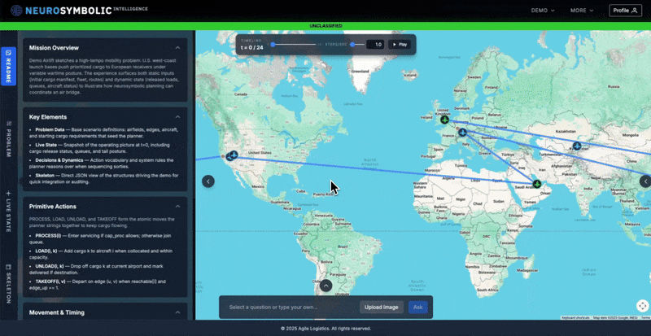
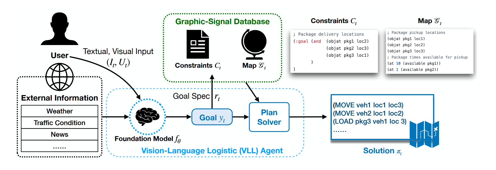
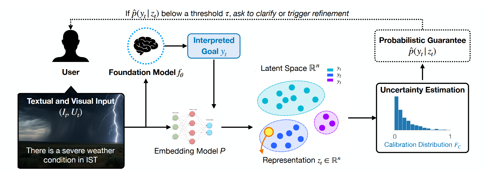
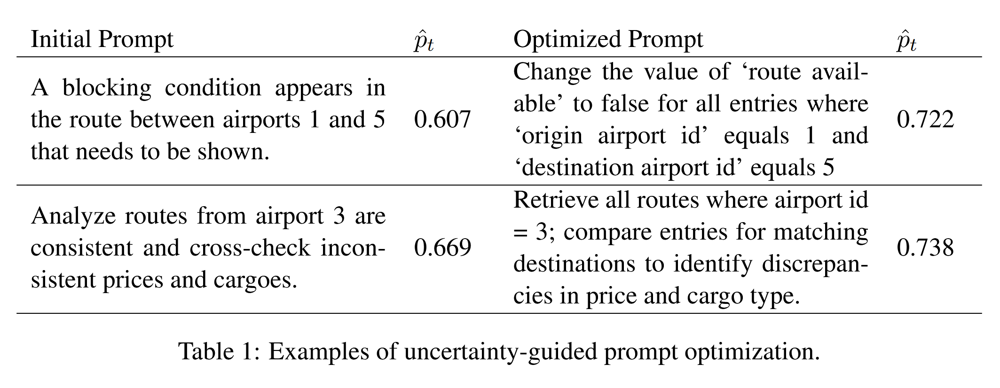
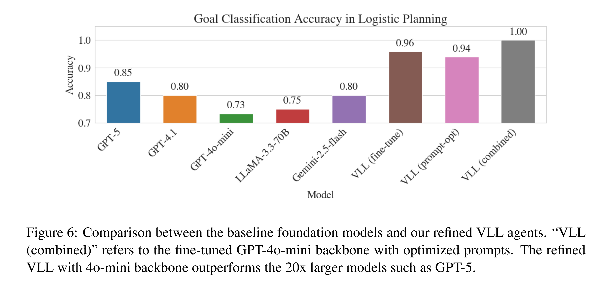

# Foundation Models for Logistics Operations: Towards Certifiable, Conversational Interfaces

We introduce a neurosymbolic framework that enhances multimodal logistics by converting natural-language requests into verifiable planning specifications. By quantifying and addressing uncertainty at the token level through an interactive clarification loop, our approach enables certifiable, real-time decision-making that outperforms significantly larger models with lower latency.

## Demo Videos



**Full video** available at: [here](./examples/DIU%20Demo%20V2.mp4)

## Framework

<p align="center">
    
</p>

Overview of an VLL agent. Language and visual inputs are converted into structured goals, filtered through an uncertainty‑aware verifier, and dispatched to symbolic planners.

<p align="center">
    
</p>

Overview of the uncertainty-aware intent-verification loop. The agent takes multimodal inputs—textual instructions and visual data—and embeds them into a learned latent space where intent types form distinct clusters. It computes a probabilistic guarantee from the distance to the nearest cluster centroid, and, if the guarantee falls below a threshold, proactively issues a clarification query before formalizing the goal to ensure downstream planners work with the correct intent.

## Results

<p align="center">
    
</p>

<p align="center">
    
</p>

## Local Development Setup
These instructions guide you through setting up the simulation environment on Linux.

### Prerequisites
*   You must have a Conda installation (Miniconda or Anaconda)

### Installation Steps

1.  **Create the Conda Environment**

    This command will create a new Conda environment named `airlift` with all the required dependencies specified in the `environment.yml` file.

    ```bash
    conda env create -f airlift-starter-kit/environment.yml
    ```

2.  **Install the `airlift` Package in Editable Mode**

    Activate the conda environment. 
    ```bash
    conda activate airlift-solution
    ```
   

    Then run this installation to download the airlift software package. 

    ```bash
    pip install -e ./airlift
    ```

3.  **Activate the Conda Environment**

    To start working on the project, you need to activate the Conda environment in your terminal.

    ```bash
    conda activate airlift-solution
    ```

    Your terminal prompt should now indicate that you are in the `airlift` environment. You are now ready to run the simulation and work on the code.

4.  **Update database and return solution**

    To start working on the project, you need to activate the Conda environment in your terminal.

     ```bash
     python db-update/json_update.py
     ```

     You can use the `--instruction` argument to pass in a natural language instruction or modify the user prompt directly in this file.
    
    The updated database is stored in the `database` folder with the name `updated_database.json` and the solution is stored in the `solution` folder with the name `updated_solution.json`

## Repository structure (root)

- airlift — simulator and main Python package
- airlift-starter-kit — environment and quickstart files (Conda/Env)
- examples — demo media (GIF/MP4) and example assets
- notebooks — Jupyter notebooks for contrastive learning
- prompt-optimizer — fine-tuning and prompt optimization tools (DPO, TextGrad)
- db-update — scripts to update the database and return solutions
- database — input databases (JSON)
- solution — generated solution outputs (JSON)

## Example Notebooks
[Contrastive Learning Notebook](./notebooks/Contrastive_Learning.ipynb)

## Model Fine-Tuning
[DPO Fine-Tuning](./prompt-optimizer/dpo.py)

## Prompt Optimization
[TextGrad Prompt Optimizer](./prompt-optimizer/textgrad_optimizer.py)

## Sample Training Data
[Fine-Tuning Training Data](./prompt-optimizer/dpo_training_data.jsonl)<br>
[Prompt Optimization Training Data](./prompt-optimizer/samples.jsonl)
